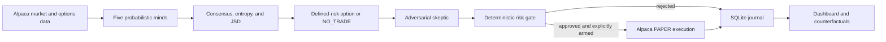

<p align="center">
  
</p>

# Lyceum — A Market of AI Minds

**Multiple minds. One market. Lyceum trades the uncertainty.**

[](https://www.python.org/)
[](https://github.com/Futurecontingents/lyceum-ai-trading/actions/workflows/ci.yml)
[](LICENSE)
[](https://alpaca.markets/)

Lyceum is an autonomous AI/options research-and-trading system that turns agent disagreement into measurable uncertainty, then tests whether that uncertainty can be monetized through cost-aware, defined-risk options. Its strength is the methodology—not a claimed profitable strategy.

> Paper only. `READ_ONLY` is the default. Lyceum has no live mode, and nothing here is investment advice.

[Open the credential-free demo](https://futurecontingents.github.io/lyceum-ai-trading/) · [Read the submission](docs/HACKATHON_SUBMISSION.md) · [See current results](artifacts/submission/current_results.md)


## Why Lyceum

Most AI trading agents end with an opaque `BUY` or `SELL`. Options require more: uncertainty, liquidity, maximum loss, and the cost of crossing two markets twice. Lyceum asks five specialized minds for full probability distributions, measures entropy and Jensen–Shannon divergence (JSD), constructs an option candidate or `NO_TRADE`, and then submits that candidate to an adversarial skeptic and deterministic risk gate.

## System



**AI proposes. Math validates. Alpaca executes.**

The five minds are:

- `TechnicalQuantAgent` — deterministic multi-horizon price/volume evidence
- `OptionsMarketAgent` — deterministic implied-versus-realized volatility evidence
- `NewsCatalystAgent` — local Qwen3 catalyst assessment without directional advocacy
- `BullAdvocateAgent` — local Qwen3 strongest evidence-supported upside case
- `BearAdvocateAgent` — local Qwen3 strongest evidence-supported downside case

The three model-backed roles use distinct prompts through the existing OpenAI-compatible provider abstraction. Model text is untrusted: strict `AgentOpinion` validation, finite normalized probabilities, bounded timeouts, and automatic deterministic fallback are mandatory. Consensus, skeptic, risk, and execution remain deterministic.

## Alpaca integration

Alpaca is the system boundary for market data, option chains, account state, and paper orders:

- [CLI OAuth/data bridge](src/lyceum/data/alpaca_cli.py)
- [Paper-only execution adapter](src/lyceum/execution/paper.py)
- [Deterministic pre-trade gate](src/lyceum/risk/gate.py)
- [Paper MCP declaration](.codex/config.toml)
- [Paper-endpoint configuration invariant](src/lyceum/config.py)

The judging workflow uses a dedicated fresh **$100,000 Alpaca paper account**, an authenticated Alpaca CLI profile, and Alpaca's hosted paper MCP. Credentials and account state are never committed.

## Research: statistical signal versus executable economics

Historical work uses **361,439 five-minute bars across 666 sessions**, spanning **2024-01-02 through 2026-08-28** for SPY, QQQ, AAPL, NVDA, AMD, META, and TSLA. The 2026-08-31 captured option session was excluded from historical training and used only for a separately frozen, pre-market execution-economics diagnostic.

Chronological walk-forward tests found:

- directional predictability is weak;
- short-horizon realized volatility is substantially more predictable;
- council disagreement adds modest incremental volatility information;
- converting even a statistically useful signal into option P&L is difficult because quoted-side entry and exit costs dominate many structures;
- a feasible option is often `NO_TRADE` when expected gross movement does not exceed estimated round-trip cost.

Historical association is not executable performance. Midpoint P&L is not treated as attainable. Lyceum reports quoted-side crossing costs and makes **no profitability or proven-edge claim**.

## Sealed forward test

Candidates A–E were preregistered and frozen before the 2026-09-01 market session. Their manifest, thresholds, model parameters, option-construction rules, and runner behavior are immutable for the session. The test uses a shared market snapshot and conservative quoted-side scoring; it is shadow-only and cannot place orders.

- [Frozen manifest](research/forward_test_2026-09-01.json)
- [Forward-test runner](scripts/forward_test_runner.py)
- [Current public status](artifacts/submission/current_results.md)

Until the session produces scored observations, the forward result is **in progress**, not zero performance and not evidence for or against an edge.

## Safety

Risk is code, never an LLM opinion. The gate checks endpoint identity, maximum loss, daily realized loss, portfolio heat, position count, concentration, spreads, quote freshness, liquidity, buying power, duplicates, cooldown, skeptic veto, and the `HALT` switch. Execution modes are `READ_ONLY`, `SIMULATED`, and double-gated `PAPER_AUTONOMOUS`; no live endpoint or live mode exists.

Every observation, opinion, decision, rejection, preview, paper order, position snapshot, counterfactual, latency, and fallback is journaled in SQLite.

## Run the demo

```bash
git clone https://github.com/Futurecontingents/lyceum-ai-trading.git
cd lyceum-ai-trading
python3 -m venv .venv
source .venv/bin/activate
pip install -e '.[dev]'
python -m lyceum run --once --demo
python -m lyceum dashboard
pytest && ruff check .
```

The demo is deterministic, credential-free, and cannot submit an order. Real Alpaca use requires a local OAuth-authenticated paper profile; see the [judging-account runbook](docs/JUDGING_ACCOUNT.md).

## Documentation map

- [Submission overview](docs/HACKATHON_SUBMISSION.md)
- [Official requirement audit](docs/HACKATHON_FINAL_REQUIREMENTS.md)
- [Architecture](docs/ARCHITECTURE.md) and [strategy equations](docs/STRATEGY.md)
- [Judging-account runbook](docs/JUDGING_ACCOUNT.md)
- [Frozen experiment design](research/forward_test_2026-09-01.json)
- [Current results](artifacts/submission/current_results.md)
- [Research archive map](docs/README.md)

## Built with

Alpaca Trading API, Alpaca MCP, Alpaca CLI, Python, Streamlit, SQLite, Ollama, Qwen3, Pydantic, pandas, and `alpaca-py`.

## Disclaimer

Educational paper-trading and research software only. Options are risky, and paper fills differ materially from live execution. Past, hypothetical, or shadow results do not predict future returns.
