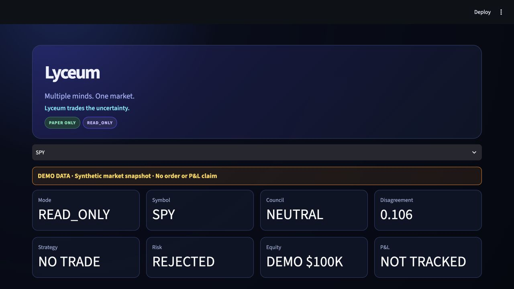
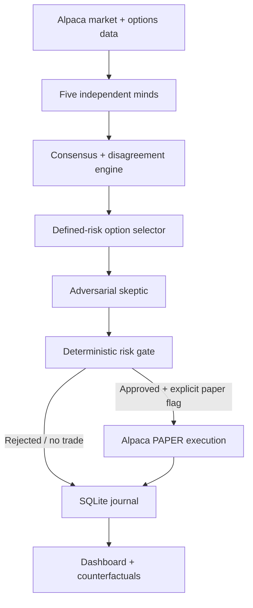
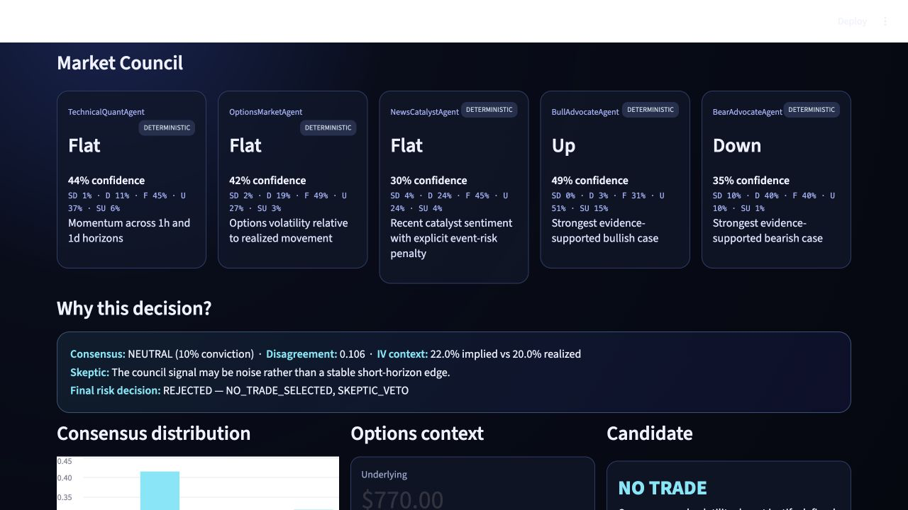

<p align="center">
  
</p>

# Lyceum

**Multiple minds. One market.**  
**Lyceum trades the uncertainty.**

[](https://www.python.org/)
[](https://github.com/Futurecontingents/lyceum-ai-trading/actions/workflows/ci.yml)
[](LICENSE)
[](https://alpaca.markets/)

An autonomous market of specialized AI minds that turns disagreement into defined-risk options decisions. Lyceum is a complete paper-trading vertical slice: live Alpaca data, structured market agents, explicit consensus mathematics, option selection, an adversarial skeptic, deterministic risk, paper execution, SQLite memory, counterfactuals, and a polished dashboard.

> Safety: Lyceum has no live mode. `READ_ONLY` is the default. No result in this repository is financial advice or a promise of profitability.



## The Idea

Most trading agents ask a model for a BUY or SELL label. Lyceum asks five independent minds for full probability distributions. It measures not only where the council points, but how much its members disagree.

The research hypothesis is deliberately modest: **AI-agent disagreement may contain information about short-horizon realized volatility.** The historical experiment tests that claim; it does not assume it.

## How It Works



The Alpaca integration is visible and current: the authenticated `paper` CLI profile supplies programmatic data, while Codex is connected to Alpaca's hosted paper MCP at `https://paper-api.alpaca.markets/mcp`. No obsolete MCP v1 initialization is used.

## Market Council

- `TechnicalQuantAgent` — multi-horizon momentum
- `OptionsMarketAgent` — implied versus realized uncertainty
- `NewsCatalystAgent` — catalyst sentiment and event risk
- `BullAdvocateAgent` — strongest evidence-supported upside case
- `BearAdvocateAgent` — strongest evidence-supported downside case

Every mind returns the same Pydantic-validated schema: five probabilities summing to one, expected return, confidence, evidence, reasoning summary, horizon, and data freshness. Minds cannot submit orders.

## Hybrid AI Council

Lyceum is deterministic by default. `TechnicalQuantAgent` and `OptionsMarketAgent` always remain quantitative, deterministic agents. In optional `HYBRID` mode, the news, bull, and bear roles can use any configured OpenAI-compatible model—including Featherless through its [documented `https://api.featherless.ai/v1` base URL](https://featherless.ai/docs/quickstart-guide). The model ID remains a user choice.

Model text is untrusted: Lyceum extracts JSON, validates the strict `AgentOpinion` schema, checks finite normalized probabilities, uses bounded timeouts/retries, and falls back to the deterministic implementation on any failure. Provider, model, prompt version, latency, implementation, and fallback state are journaled and shown in the dashboard. Consensus, strategy selection, the skeptic, risk, endpoint verification, and execution remain provider-independent and deterministic.



## From Disagreement to Options

Lyceum supports bull call spreads, bear put spreads, long straddles, iron condors, and `NO_TRADE`. Selection considers direction, Jensen–Shannon disagreement, consensus entropy, implied volatility, expected move, expiry, liquidity, bid/ask width, and maximum loss. A strategy is only a candidate until the skeptic and deterministic risk gate approve it.

See [Strategy equations](docs/STRATEGY.md) and [reference architecture](docs/REFERENCE_ARCHITECTURE.md).

## Risk

Risk is code—not an LLM opinion. The gate checks the paper endpoint immediately before execution, max loss, daily realized loss, portfolio heat, position count, concentration, spread, quote freshness, liquidity, buying power, duplicates, cooldown, skeptic veto, and the `HALT` emergency switch.

Execution modes are exactly:

- `READ_ONLY` — default; produces a complete order preview
- `SIMULATED` — synthetic fills in the journal
- `PAPER_AUTONOMOUS` — requires both the mode and `LYCEUM_ENABLE_PAPER_ORDERS=true`

There is no live mode or live endpoint.

## Demo

Generate a safe end-to-end demo decision and launch the dashboard:

```bash
python -m lyceum run --once --demo
python -m lyceum dashboard
```

The demo never submits an order. The real runner respects the market clock:

```bash
python -m lyceum run
```

## Quick Start

```bash
git clone https://github.com/Futurecontingents/lyceum-ai-trading.git
cd lyceum-ai-trading
python3 -m venv .venv
source .venv/bin/activate
pip install -e '.[dev]'
alpaca profile login --paper --name paper
python -m lyceum doctor
pytest && ruff check .
```

Optional SDK credentials belong only in a local `.env`; `.env` is ignored. CLI and hosted MCP authentication use browser OAuth and do not require copying secrets into this repository.

For the eventual clean competition profile, follow [the judging-account runbook](docs/JUDGING_ACCOUNT.md). It does not create or switch accounts automatically.

## Architecture

The package separates `agents`, `data`, `consensus`, `strategies`, `risk`, `execution`, `memory`, and `dashboard`. SQLite persists observations, opinions, decisions, rejections, orders, positions, P&L snapshots, counterfactuals, and errors. See [Architecture](docs/ARCHITECTURE.md).

## Research Hypothesis

Run the pragmatic, point-in-time hourly experiment:

```bash
python -m lyceum experiment
```

It reports sample size, Pearson and Spearman correlations, disagreement quartiles, subsequent absolute return, and subsequent realized volatility at 1h, 4h, and one trading day. Weak results are reported honestly; the fallback uses market regime, momentum, option-implied volatility, and consensus.

## Results

### Current paper results

No paper P&L is claimed yet. Setup validation placed no orders. Results will appear only after observed autonomous paper sessions.

### Historical experiment

See [the generated experiment report](docs/EXPERIMENT_RESULTS.md). Historical association is not execution performance and is not evidence of profitability.

## Built With

- Alpaca Trading API and official `alpaca-py`
- Alpaca Trading CLI and hosted Alpaca MCP (paper endpoint)
- Python, Pydantic, SQLite, pandas, and Streamlit
- Five deterministic probabilistic agents, plus an optional provider-neutral hybrid council; no paid LLM provider is required

## Hackathon

Built for the **Alpaca AI Trading Agents Hackathon 2026**. The final judging account is expected to be a fresh $100,000 paper account; the current account is development-only.

See the concise [hackathon submission](docs/HACKATHON_SUBMISSION.md).

## Disclaimer

Educational paper-trading software only. Options are risky. Paper fills differ materially from real execution. Nothing here is investment advice, and past or hypothetical results do not predict future returns.
