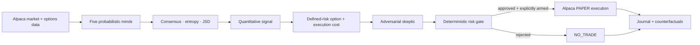

<p align="center">
  
</p>

# Lyceum — A Market of AI Minds

**AI proposes. Math validates. Alpaca executes.**

[](https://www.python.org/)
[](https://github.com/Futurecontingents/lyceum-ai-trading/actions/workflows/ci.yml)
[](LICENSE)
[](https://alpaca.markets/)

Lyceum is an autonomous AI/options research-and-trading system. It treats five agent outputs as competing probabilistic beliefs, measures their disagreement, and asks a harder question than “up or down?”: does the expected option payoff still exist after liquidity, crossing costs, skepticism, and deterministic risk controls?

Lyceum has **not** demonstrated a profitable executable option edge. That is a result, not a hidden footnote: unsupported candidates resolve to `NO_TRADE`.

> Paper only. `READ_ONLY` is the default. Lyceum has no live-trading mode, and nothing here is investment advice.

[Open the credential-free demo](https://futurecontingents.github.io/lyceum-ai-trading/) · [Read the final research report](research/FINAL_RESEARCH_REPORT.md) · [See the current evidence layers](artifacts/submission/current_results.md)


## Why Lyceum

Most AI trading demos end with an opaque `BUY` or `SELL`. Options require probability, uncertainty, liquidity, maximum loss, and the cost of crossing multiple legs at entry and exit. Lyceum makes those requirements explicit—and permits deterministic code to reject the AI.

The differentiator is the evidence loop:

1. five specialized minds emit full probability distributions;
2. consensus mathematics measures entropy and Jensen–Shannon divergence (JSD);
3. decades of causal market data test the hypotheses;
4. an option mapper estimates real quoted-side economics;
5. a skeptic and deterministic risk gate can reject the proposal;
6. every decision, rejection, feature, timestamp, and counterfactual is journaled.

## How it works



Missing required features fail closed. No missing disagreement value can silently become zero. No invalid observation enters a leaderboard. `NO_TRADE` is the default whenever expected executable economics do not clear the risk and execution hurdles.

## The five market minds

- `TechnicalQuantAgent` — deterministic multi-horizon price and volume evidence
- `OptionsMarketAgent` — deterministic implied-versus-realized volatility evidence
- `NewsCatalystAgent` — local Qwen3 catalyst assessment without directional advocacy
- `BullAdvocateAgent` — strongest evidence-supported upside interpretation
- `BearAdvocateAgent` — strongest evidence-supported downside interpretation

The three language roles use distinct prompts through one OpenAI-compatible local-model boundary. Their text is untrusted: strict `AgentOpinion` validation, normalized finite probabilities, bounded timeouts, and automatic deterministic fallback are mandatory. Consensus, skeptic, risk, and execution remain deterministic.

## Deterministic safety

The gate checks endpoint identity, maximum loss, daily realized loss, portfolio heat, concentration, position count, buying power, bid/ask width, quote freshness, liquidity, duplicates, cooldown, skeptic veto, and the `HALT` switch. Execution modes are `READ_ONLY`, `SIMULATED`, and double-gated `PAPER_AUTONOMOUS`; the configured endpoint is asserted as Alpaca paper immediately before execution.

Every observation, opinion, decision, rejection, preview, paper order, position snapshot, fallback, latency, and counterfactual is recorded in SQLite. Credentials, local databases, account identifiers, and logs are not committed.

## Research methodology

Lyceum separates four evidence layers that are often blurred together:

- **Underlying history:** 8,453 SPY sessions over 33.58 years, plus a 14,286-session / 56.65-year S&P 500 index proxy.
- **Recent intraday history:** 361,439 five-minute observations across 666 sessions and seven liquid symbols.
- **Real option economics:** 9,627 point-in-time structure observations from captured Alpaca option quotes; recent and real, but only one partial session.
- **Forward evidence:** preregistered, timestamped shadow tests reported separately from development and reconstruction.

The long-history campaign registered 19 hypotheses, used chronological train/validation/holdout windows, dependence-aware inference, block bootstrap intervals, surrogate nulls, family-wise selection control, drop-one-era tests, and explicit transaction-cost gates. Midpoint P&L is diagnostic; quoted-side P&L is the conservative executable measure.

## What 33 years of data showed

| Classification | Finding | Meaning |
|---|---|---|
| **SUPPORTED** | SPY close-to-open drift | Positive across decades and seven of eight eras; an underlying effect, not a proven option trade. |
| **SUPPORTED** | HAR-style volatility forecasting | Meaningful out-of-sample predictability versus simple trailing-volatility baselines. |
| **INCONCLUSIVE** | Full LLM council value-add | The council has not beaten technical-only or simple momentum on directional development measures. |
| **INCONCLUSIVE** | Rare capitulation states | Some moves approach option-relevant magnitude, but recent/effective sample sizes and robustness are inadequate. |
| **REJECTED** | Ordinary directional option conversion | Expected movement is usually far below the observed round-trip hurdle. |
| **REJECTED** | Proven profitable executable option alpha | No tested strategy has earned this claim. |

See the [canonical final research conclusion](research/FINAL_RESEARCH_REPORT.md) and the [reproducible long-history campaign](research/long_history_signal_campaign.md).

## What failed—and why that matters

The Sep-01 A–E shadow experiment is **invalid as a complete preregistered test**. The deployed collector never invoked the council producer, while the runner silently replaced missing disagreement and entropy with zero; C and D therefore lacked their frozen inputs. The scorer also reused a 60-minute excursion window for 5/15/30-minute MFE/MAE.

Lyceum preserved the original manifest, database, logs, and code. A later reconstruction is labeled **post-hoc only**. The repaired V2 path requires five-agent provenance where needed, rejects missing/non-finite/temporally impossible features, and computes excursions inside each horizon. Repairing the infrastructure does not repair the failed experiment.

- [Incident report](research/incidents/SEP01_FORWARD_TEST_FAILURE.md)
- [Post-hoc diagnostic reconstruction](research/sep01_reconstruction.md)
- [Frozen Sep-03 read-only specification](research/sep03_preregistration.md)

## The execution-cost finding

The strongest long-history underlying result implied about **$0.44** of recent SPY movement versus a median observed delta-adjusted vertical hurdle of **$4.44**—a move/cost ratio of **0.098**. Across 4,878 eligible directional structures, zero had positive expected gross movement after the estimated quoted round trip.

At 60 minutes, one reversal diagnostic earned **+$3.23** at midpoint but paid **$29.05** entering and **$40.77** exiting, becoming **-$66.59** at quoted sides. Lyceum therefore targets `TRADE / NO_TRADE` before direction and models exit liquidity separately.

## Live paper validation

- Sep-01: frozen A–E experiment invalidated and preserved; not forward performance evidence.
- Sep-02: execution-economics research was frozen pre-open, but no clean trade-producing sealed candidate was promoted.
- Sep-03: a frozen, observation-only `NO_TRADE` specification is preregistered. Static preflight passed; its live canary and any outcomes remain future evidence.

One or two sessions are anecdotal plumbing and execution evidence, not statistical proof. The public summary never merges paper fills, midpoint diagnostics, historical association, or post-hoc reconstruction into a single “P&L” number.

## Alpaca integration

Alpaca supplies market and option data, account state, and paper order primitives. Lyceum uses the Alpaca Trading API and `alpaca-py`, an authenticated Alpaca CLI OAuth/data bridge, and Alpaca's hosted paper MCP resource.

- [CLI bridge](src/lyceum/data/alpaca_cli.py)
- [Paper-only execution adapter](src/lyceum/execution/paper.py)
- [Deterministic pre-trade gate](src/lyceum/risk/gate.py)
- [Paper MCP declaration](.codex/config.toml)
- [Paper-endpoint invariant](src/lyceum/config.py)

## Reproduce

```bash
git clone https://github.com/Futurecontingents/lyceum-ai-trading.git
cd lyceum-ai-trading
python3 -m venv .venv
source .venv/bin/activate
pip install -e '.[dev]'

# Credential-free deterministic demo; cannot submit an order
python -m lyceum run --once --demo
python -m lyceum dashboard

# Public quality gate
pytest
ruff check .
```

The machine-local raw data are intentionally excluded. Provider URLs, hashes, splits, scripts, seeds, and committed result artifacts are documented in the [data audit](research/long_history_data_audit.md).

## Demo

The [GitHub Pages demo](https://futurecontingents.github.io/lyceum-ai-trading/) is static, sanitized, credential-free, and read-only. It shows five probability distributions, consensus, entropy/JSD, `NO_TRADE`, skeptic reasoning, deterministic risk rejection, and the research context. It does not access an Alpaca account or imply live performance.

## Limitations

- No profitable executable option edge has been demonstrated.
- The real option-quote sample is recent but narrow; it is not decades of option NBBO history.
- The full LLM council has not demonstrated incremental directional or executable value.
- Paper fills differ from live fills, and one or two forward sessions cannot establish an edge.
- The S&P 500 proxy extends regime context but is not a tradeable pre-SPY option history.

## Documentation

- [Final research report](research/FINAL_RESEARCH_REPORT.md)
- [Final backend freeze](research/final_backend_manifest.json)
- [Submission overview](docs/HACKATHON_SUBMISSION.md)
- [Architecture](docs/ARCHITECTURE.md)
- [Judging-account runbook](docs/JUDGING_ACCOUNT.md)
- [Research index and archive](research/README.md)

## Built with

Alpaca Trading API, Alpaca MCP, Alpaca CLI, Python, Streamlit, SQLite, Ollama, Qwen3, Pydantic, pandas, and `alpaca-py`.

## Disclaimer

Educational paper-trading and research software only. Options are risky, and paper fills differ materially from live execution. Past, hypothetical, shadow, or reconstructed results do not predict future returns.
