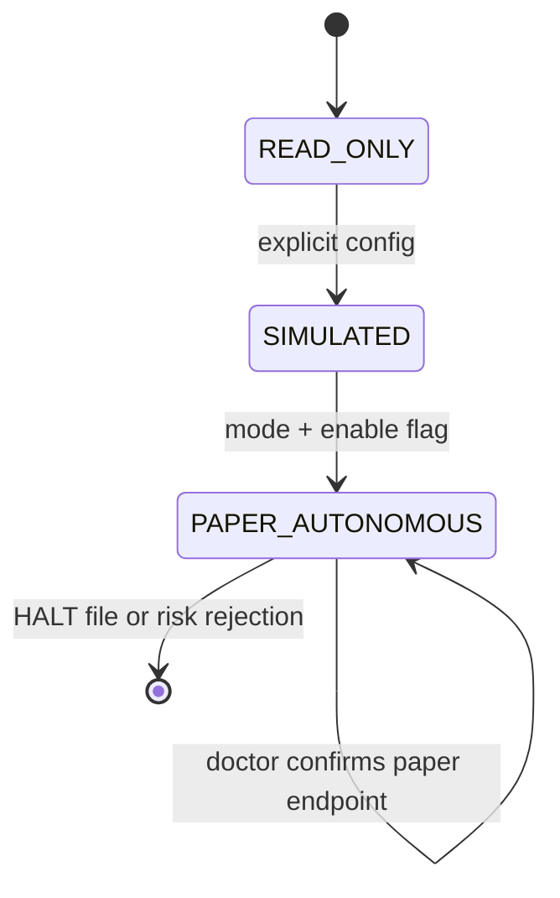

# Architecture

## Boundaries

- `data/`: authenticated read-only Alpaca CLI gateway; parses current stock bars and option snapshots.
- `agents/`: five independently biased deterministic probabilistic minds.
- `consensus/`: pure entropy, Jensen–Shannon, and directional calculations.
- `strategies/`: defined-risk structure selection and skeptic review.
- `risk/`: deterministic gate; no model or agent can override it.
- `execution/`: the only module allowed to construct or submit an order. It has no live mode.
- `memory/`: SQLite schema and append-oriented journal.
- `dashboard/`: read-only visualization of journal state.
- `runner.py`: bounded orchestration and fault isolation.

## Modes and trust boundary

No `LIVE` enum, URL, environment option, or executor exists. `PAPER_AUTONOMOUS` requires two explicit settings and an immediate `alpaca doctor` assertion. The emergency halt is recoverable: create `HALT` to reject new candidates, inspect state, then remove it deliberately.

## Failure behavior

Each symbol is isolated. API failures, missing chains, malformed payloads, and validation errors are written to `errors`. Market-closed cycles return without orders. CLI calls have bounded timeouts. `NO_TRADE`, rejections, and counterfactual alternatives are durable first-class records.

## MCP visibility

The repository's `.codex/config.toml` names only `https://paper-api.alpaca.markets/mcp`. Runtime decision payloads also record that endpoint. The hosted MCP is used for agent-accessible account, clock, option-chain, Greeks, and market-data tools; the Python runner uses the already-authenticated official CLI profile as its local OAuth bridge.

