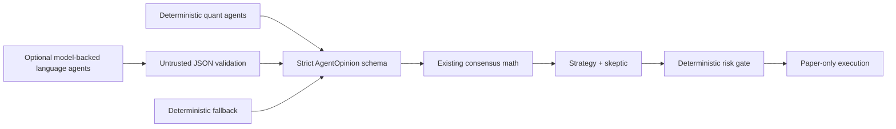
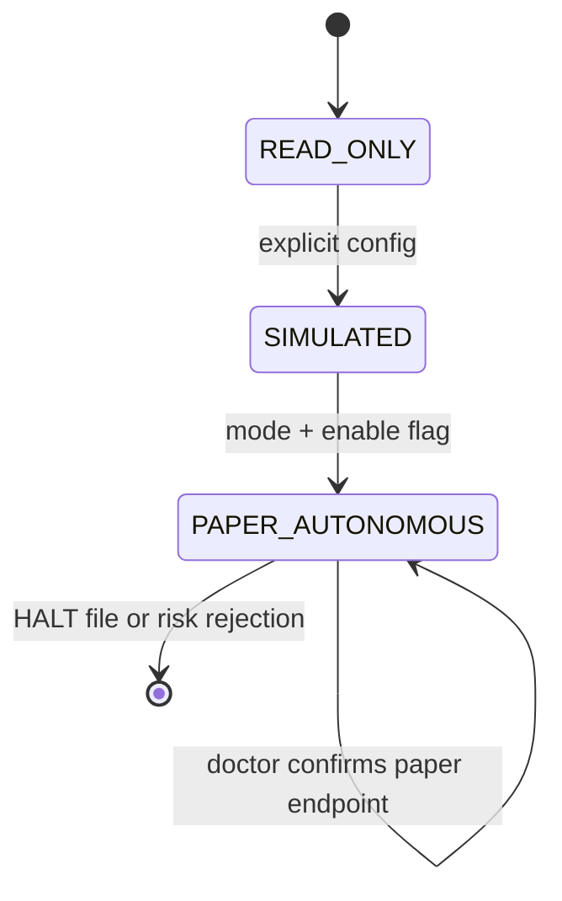

# Architecture

## Boundaries

- `data/`: authenticated read-only Alpaca CLI gateway; parses current stock bars and option snapshots.
- `agents/`: five independently biased probabilistic minds; three language-heavy roles may be model-backed in `HYBRID` mode.
- `models/`: shared schemas plus a minimal OpenAI-compatible provider boundary. Model text is always validated before it becomes an opinion.
- `consensus/`: pure entropy, Jensen–Shannon, and directional calculations.
- `strategies/`: defined-risk structure selection and skeptic review.
- `risk/`: deterministic gate; no model or agent can override it.
- `execution/`: the only module allowed to construct or submit an order. It has no live mode.
- `memory/`: SQLite schema and append-oriented journal.
- `dashboard/`: read-only visualization of journal state.
- `runner.py`: bounded orchestration and fault isolation.

## Hybrid council

`TechnicalQuantAgent` and `OptionsMarketAgent` are always deterministic. `NewsCatalystAgent`, `BullAdvocateAgent`, and `BearAdvocateAgent` use the same deterministic implementations by default and may be wrapped by a configured `ModelProvider` in `HYBRID` mode. The provider returns untrusted text; JSON extraction, finite-number checks, safe near-sum normalization, Pydantic validation, bounded retries, and timeouts sit before the existing `AgentOpinion` boundary. Any error immediately yields the corresponding deterministic opinion.

The model provider never receives credentials for Alpaca, never calls execution, and cannot alter the risk decision. Trace metadata is stored with each opinion; API keys are not.

## Modes and trust boundary

No `LIVE` enum, URL, environment option, or executor exists. `PAPER_AUTONOMOUS` requires two explicit settings and an immediate `alpaca doctor` assertion. The emergency halt is recoverable: create `HALT` to reject new candidates, inspect state, then remove it deliberately.

## Failure behavior

Each symbol is isolated. API failures, missing chains, malformed payloads, model timeouts, and validation errors degrade safely or are written to `errors`. Market-closed cycles return without orders. CLI calls have bounded timeouts. `NO_TRADE`, rejections, and counterfactual alternatives are durable first-class records.

## MCP visibility

The repository's `.codex/config.toml` names only `https://paper-api.alpaca.markets/mcp`. Runtime decision payloads also record that endpoint. The hosted MCP is used for agent-accessible account, clock, option-chain, Greeks, and market-data tools; the Python runner uses the already-authenticated official CLI profile as its local OAuth bridge.
